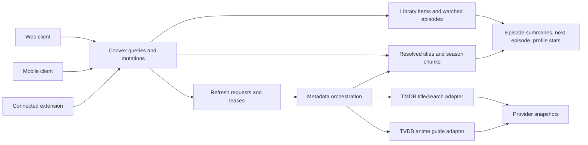

# Architecture review and refactor

Reviewed against `main` at `7fcc8b3`. The review covered both clients and the shared backend, with separate implementation branches `mobile/refactor` and `webapp/refactor`.

## Findings addressed in this PR

| Severity | Finding and effect | Change |
| --- | --- | --- |
| High | An empty TVDB response fell back to TMDB episodes while retaining TVDB identity and season order. Watched state could then refer to the wrong provider episode. | Treat the selected provider's empty response as authoritative. |
| High | Title refresh and publication removed confirmed empty seasons from the persisted catalog. Later episodes could not be refreshed because the season was considered nonexistent. | Keep the catalog intact; apply availability in the read projection and reject stale or mismatched count overrides. |
| Important | Failed or skipped TVDB count requests became zero totals, hiding seasons for the normal title cache lifetime. | Add optional `episodeCountVerified`; unknown counts remain selectable, show pending text, and use shorter retry/cache intervals. |
| Important | Chunk pagination could combine pages from different metadata versions, including a restarted first page. | Return the canonical season version and assemble only a contiguous, matching set of pages without duplicate chunks. |
| Important | Add and Explore duplicated debounce/request state; media filter changes repeated the same search and previous-query results remained visible. | A shared title-search hook owns normalization, debounce, stale-response rejection, and errors. Media filters operate on its results. |
| Important | Item detail fetched the full library as a fallback and for tag suggestions, although dedicated endpoints existed. | Use the authoritative item view and request tag suggestions when needed. |
| Important | Schema, public return validators, canonical write validators, and provider cache validators repeated the same shapes. An accepted anime episode with `stillPath` could fail storage validation. | Compose table/write shapes from shared validators; cache writes and storage use one provider snapshot contract. |
| Suggestion | TVDB, calendar, sync, and metadata orchestration depended on rate-limit functions housed inside the TMDB adapter. | Move common limits to `providerRateLimits.ts`, preserving provider-specific budgets. |
| Suggestion | Season choice logic was repeated across hooks, screens, and the picker; route preview parsing bypassed existing validation. | Share season selection and validated title preview parsing. |
| Suggestion | Three indexes had no callers, and the README described an extension-only project with commands that failed at the repository root. | Remove unused indexes and document the current repository structure and commands. |

The web PR applies corresponding search, detail lifecycle, filtering, pagination, and concurrency fixes in `app/web` without moving the backend or changing existing endpoint names.

## Data ownership

`mediaType + tmdbId` is the catalog identity. A mapped TVDB title adds its provider ID, season order, and `orderEpoch`. Provider episode IDs and the active mapping determine whether stored watched state belongs to the displayed episode. A provider refresh must never relabel another provider's episodes to fill an empty result.

Existing outage recovery still preserves a last known canonical season when an upstream request fails. Borrowed artwork now requires matching content evidence as well as coordinates, since different provider orders can assign the same number to different episodes.

`items` and `episodes` hold user-owned state. `resolvedTitles`, `resolvedSeasons`, and `resolvedSeasonChunks` hold shared canonical metadata. `providerSnapshots` cache bounded upstream responses; they are not the canonical database. `titleMappings` records identity and ordering decisions. Refresh requests describe work visible to clients, while leases prevent competing workers from publishing over one another.

Episode totals have two levels: the title guide's season summary and a fully published canonical season count. A canonical count may override a guide for the same ordering epoch and sufficiently recent data; an existing positive canonical count also remains usable when a newer provider count is unknown. A failed count request is unknown, not zero. Existing stored season summaries without the optional verification field retain their previous meaning.

## Complexity retained deliberately

- Chunked season storage and staged publication avoid Convex document/transaction limits and partial season visibility. Removing them would reintroduce failures on long-running series.
- Mapping epochs, request tokens, and season versions solve different races: provider identity changes, competing refresh attempts, and pagination across replacement chunks.
- Episode summaries, next-episode projections, and profile aggregates duplicate derived values to keep common reads bounded. Their repair/reconciliation paths remain necessary.
- TMDB and TVDB remain separate adapters. Shared HTTP policy, rate limiting, and snapshot contracts are provider-neutral; metadata ownership stays in the resolver.

## Compatibility and remaining boundaries

The refactor adds optional count certainty and season-version response fields. It does not rename public client endpoints or require a data backfill. Old stored rows continue to validate. Removing `items.by_user_updated_at`, `tagMemberships.by_user_tag_rank`, and `episodes.by_user_watched_at` changes indexes only; a repository-wide search found no callers.

The shared backend still lives under `app/mobile`; moving it to a workspace package should be a separate build/deployment change. The current relative generated-type imports make this ownership unusual but explicit.

Library lists remain capped at 2,000 items and episode overview scans at 200 watching entries. These are explicit personal-library limits, not complete pagination. Larger-library support should introduce server pagination and filtering together so filters cannot silently operate on a partial set.

TVDB season-count requests remain bounded by a request cap and deadline. The refactor makes incomplete totals recoverable and visible; it does not remove those provider-protection limits. A background count queue would be a separate performance feature.

Validation results and deployment limitations are recorded in the pull request. Provider regressions use deterministic fixtures; they do not certify live TMDB or TVDB availability.
